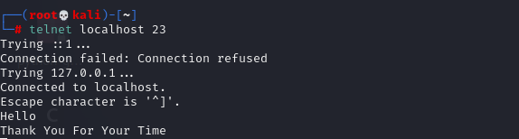
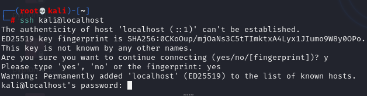

**Here is a step-by-step guide to setting up and testing a firewall on Kali Linux.**
1.  **Check UFW Status**

    
    
2.  **Enable UFW**  (Use 'sudo' if you aren't a root user)
   
    

3. **List Current Firewall Rules**

   
   
4. **Add a Rule to Block Inbound Traffic on a Specific Port (e.g., 23 for Telnet)**
   
   

   Trying to connect

   

 5. **Test the Rule by Attempting to Connect to that Port when 'Allowed'**

    

 6. **Add Rule to Allow SSH (Port 22)**

    

    To test the SSH rule, attempt to connect to your local machine via SSH:

    
    You will be prompted to confirm the connection and then for the password.

 7. **Remove the Test Block Rule to Restore Original State**

    
